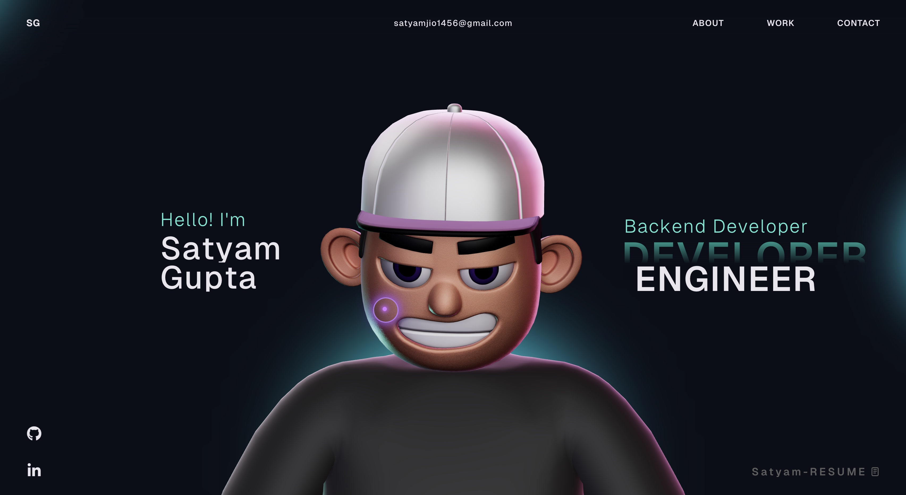
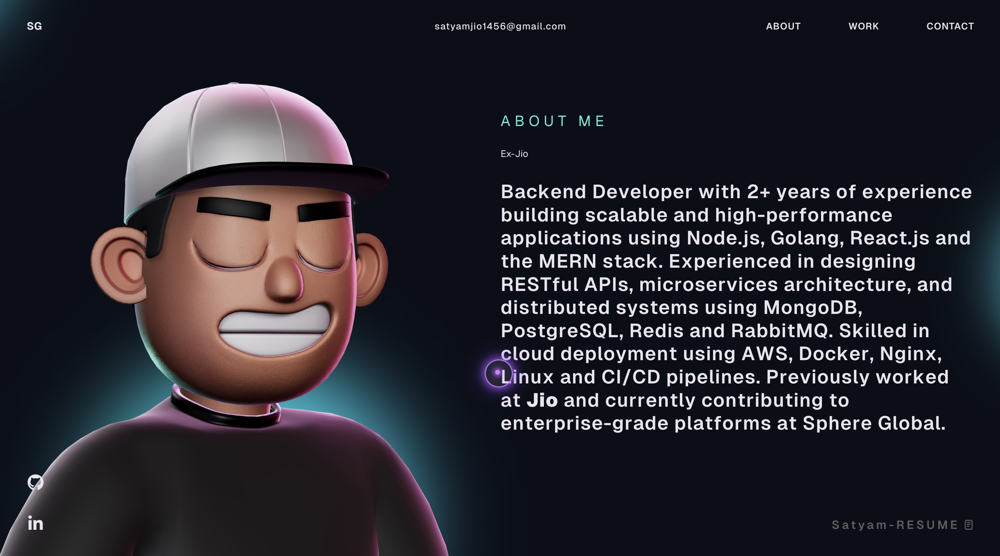
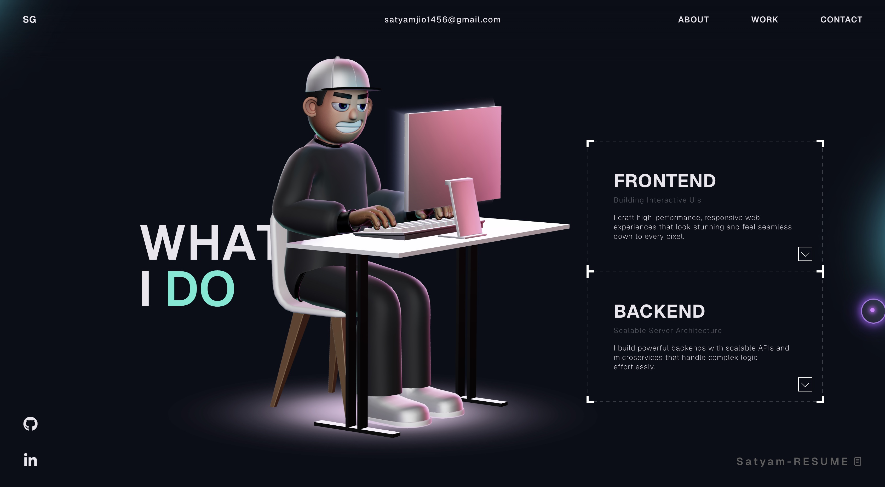
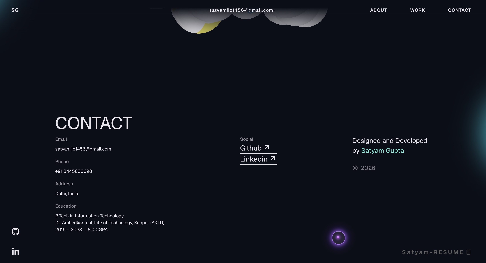

# 🌐 My Portfolio Website

🚀 Welcome to the open-source repository of my personal portfolio website.  
Built with modern web technologies to showcase my projects, skills, and creativity.

---

## ✨ Live Preview

Check out the portfolio and explore my work!

## 📦 Getting Started (Run Locally)

Follow these steps to run the project on your local machine:

```bash
# Install dependencies
npm install

# Start development server
npm run dev

## 🛠️ Tech Stack

- ⚛️ React.js  
- 🟦 TypeScript  
- 🎞️ GSAP (Animations)  
- 🌌 Three.js & WebGL  
- 🌐 HTML5, CSS3, JavaScript  

---







<!-- ## License

This project is open source and available under the [MIT License](LICENSE). -->
