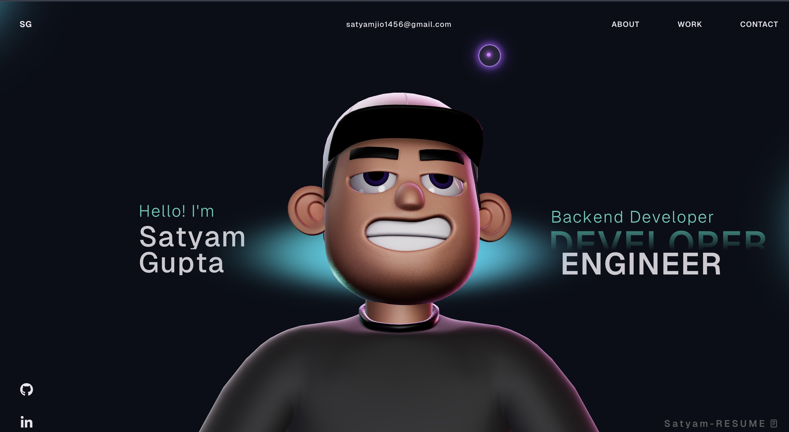

# My Portfolio Wesbite - Overview 🚀

This repository contains the open source version of my porfolio website.
Do check it out!

TO RUN IN Local =>

Follow these steps to run the project on your local machine:

```bash
# Install dependencies
npm install

# Start development server
npm run dev

<!-- ## Instructions 🛠️

I have modified the gsap club plugins with the trial plugins, but with the trial plugin you cannot host it🔴. So for Club plugins, Check out here: https://gsap.com/docs/v3/Installation/ -->

**Techstack** - 
- ⚛️ React.js  
- 🟦 TypeScript  
- 🎞️ GSAP (Animations)  
- 🌌 Three.js & WebGL  
- 🌐 HTML5, CSS3, JavaScript

# <!--  -->


<!-- ## License

This project is open source and available under the [MIT License](LICENSE). -->
